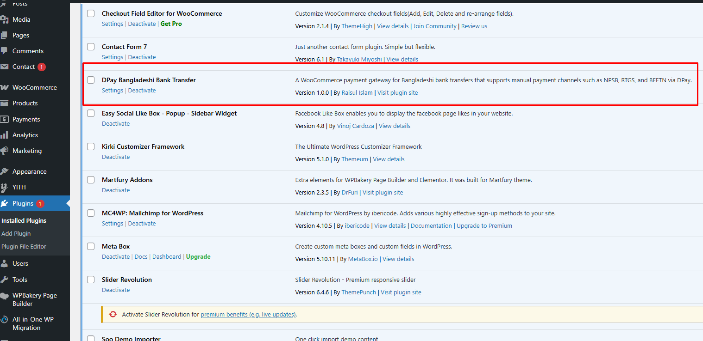
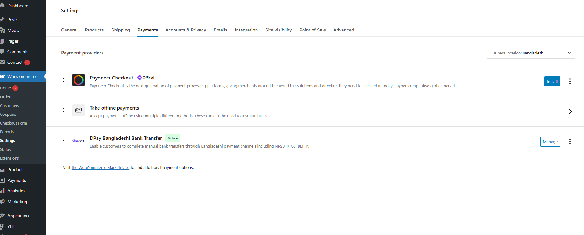
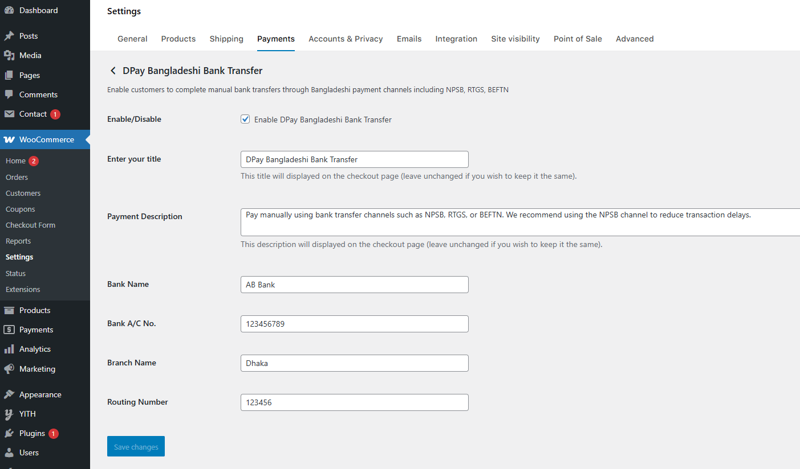
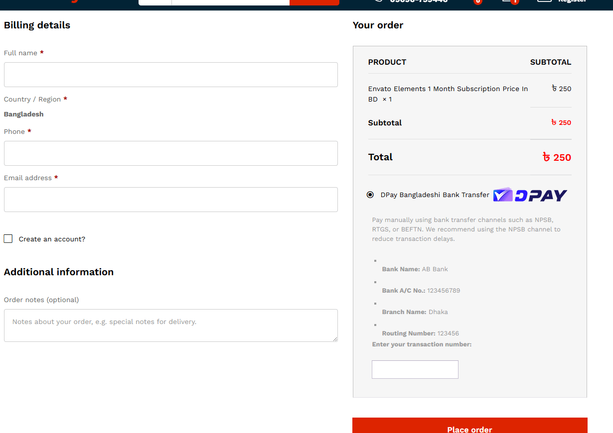

# DPay Bangladeshi Bank Transfer

**A simple and reliable WooCommerce payment gateway plugin that enables Bangladeshi customers to pay via manual bank transfers using the DPay system.**

---

## 🔍 Description

**DPay Bangladeshi Bank Transfer** is a WooCommerce payment gateway plugin tailored for Bangladeshi eCommerce businesses. This plugin allows store owners to accept payments manually through direct bank transfers using Bangladesh’s traditional banking channels — **NPSB**, **RTGS**, and **BEFTN**.

Customers will be shown your bank account details on the checkout page and asked to complete the transaction manually. It's the perfect solution for businesses that prefer offline bank payments or want to avoid the overhead of online gateways.

---

## ✨ Features

- Seamlessly integrates with WooCommerce checkout
- Accepts payments via **manual bank transfers**
- No API integration or third-party dependency required
- Support for all Bangladeshi banks
- Fully translatable and theme-compatible
- Secure and lightweight

---

## 🏦 Supported Banks

You can input and display information for any bank in Bangladesh. Some popular banks:

- BRAC Bank Limited  
- Dutch-Bangla Bank Limited  
- Islami Bank Bangladesh Limited  
- Bank Asia Limited  
- Eastern Bank Limited  
- City Bank Limited  
- Standard Chartered Bangladesh
- Many more...

---

## 🛠️ Installation

1. Download the dpay-bangladeshi-bank-transfer as a zip.
2. Upload the plugin folder to `/wp-content/plugins/` directory.
3. Activate it via the **Plugins** menu in WordPress.
4. Navigate to `WooCommerce > Settings > Payments`.
5. Enable "**DPay Bangladeshi Bank Transfer**".
6. Configure your **Bank Name**, **Account Number**, **Branch**, and **Routing Number**.

---

## 📸 Screenshots

1. Installed plugin in WordPress admin  
   

2. DPay settings under WooCommerce Payments tab  
   

3. Admin configuration for bank details  
   

4. Bank transfer option shown at checkout  
   

---

## ❓ Frequently Asked Questions

### Will this plugin work with any WordPress theme?  
Yes, it works perfectly with any theme that supports WooCommerce.

### Is this plugin secure?  
Absolutely. Since it doesn’t rely on external APIs and follows WooCommerce standards, it is secure by design.

---

## 🧾 Changelog

### 1.0.0
- Initial stable release

---

## 📦 Upgrade Notice

### 1.0.0
- First stable release of the DPay Bangladeshi Bank Transfer plugin

---

## 👨‍💻 Author

**Raisul Islam**  
deploy@raisul.dev | https://raisul.dev/ | [GitHub: Raisul447](https://github.com/Raisul447)

If you find this plugin useful, please consider starring ⭐ the repository and sharing it with others in the Bangladeshi WooCommerce community.

---

> Made with ❤️ for Bangladeshi online shops by a Bangladeshi developer.
